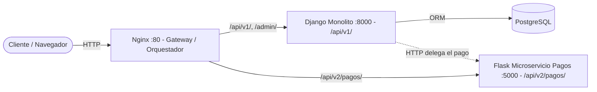

# Migración a Microservicios (Strangler Pattern)

> Página lista para copiar/pegar en la **Wiki del repositorio** (GitHub Wiki).
> Taller 02 — Arquitectura de Software 2026.

## Módulo Estrangulado: Procesamiento de Pagos

En AfinaMercado (marketplace de instrumentos) aplicamos el **Patrón del Estrangulador
(Strangler Fig Pattern)** para extraer **una** funcionalidad del monolito Django y
migrarla a un microservicio independiente en **Flask**, dejando el resto del sistema
intacto y enrutando el tráfico con **Nginx**.

## Matriz de Decisión

Evaluamos varios módulos del sistema según **Carga CPU**, **Frecuencia de Cambio** y
**Acoplamiento** con la base de datos del monolito:

| Módulo                     | Carga CPU | Frecuencia de Cambio | Acoplamiento a la BD | Decisión              |
|----------------------------|-----------|----------------------|----------------------|-----------------------|
| Autenticación              | Baja      | Baja                 | Alto                 | Mantener en Django    |
| Catálogo (Instrumentos)    | Media     | Baja                 | Alto                 | Mantener en Django    |
| Carrito de compras         | Baja      | Media                | Alto                 | Mantener en Django    |
| **Procesamiento de Pagos** | **Alta**  | **Alta**             | **Bajo**             | **Estrangular (Flask)** |

## Justificación

El módulo de **Procesamiento de Pagos** es el mejor candidato a estrangular porque:

- **Carga / Consumo de recursos (Alta):** procesar un pago implica validaciones,
  comunicación con pasarelas externas y reintentos. Es un proceso "pesado" que, dentro
  del monolito, ocupa un *worker* de Django y puede provocar *timeouts* al resto de
  usuarios que navegan el catálogo.
- **Frecuencia de cambio (Alta):** las reglas de pago cambian constantemente (nuevos
  métodos como PSE o Nequi, reglas antifraude, nuevas pasarelas). Aislarlo permite
  desplegarlo de forma independiente sin volver a desplegar todo el monolito.
- **Acoplamiento (Bajo):** el pago solo necesita `orden_id`, `monto` y `metodo`.
  No requiere el resto del modelo de datos, por lo que es fácil de separar detrás de
  una API REST con contrato JSON claro.

Módulos como **Autenticación** y **Catálogo** se mantienen en Django: están muy
acoplados a la base de datos y cambian poco, por lo que extraerlos añadiría complejidad
sin beneficio.

## Cómo logramos la separación técnica

1. **Microservicio Flask aislado** (`pago_service/app.py`): expone `POST /api/v2/pagos/`,
   recibe y responde **JSON nativo**, y maneja errores de forma estructurada
   (`400` datos inválidos, `402` pago rechazado, `404`, `405`, `500`).
2. **Costura (seam) en el monolito** (`ordenes/infra/pago_client.py`): el `OrdenService`
   ya **no** crea el pago internamente; delega vía HTTP en el microservicio. Es
   **resiliente**: si el servicio no responde, la orden queda registrada con el pago
   pendiente en vez de tumbar todo el flujo.
3. **Contenedorización (Docker):** `Dockerfile` propio para Django y otro para Flask.
4. **Orquestación de tráfico (Nginx):** `nginx.conf` bifurca según la URL — las rutas
   antiguas `/api/v1/` van a Django y la ruta estrangulada `/api/v2/pagos/` va a Flask.
   El cliente no percibe el cambio: sigue llamando al mismo host (Nginx en el puerto 8080).

## Diagrama de la nueva arquitectura



## Impacto esperado en el sistema

- **Aislamiento de recursos:** el consumo de CPU/memoria del pago ya no bloquea el hilo
  principal de Django; los picos de tráfico de pago no degradan el catálogo.
- **Despliegue independiente:** el equipo de pagos puede iterar y desplegar Flask sin
  redeploy del monolito.
- **Migración gradual y segura:** el resto del sistema sigue igual (`/api/v1/`).
  Podemos estrangular más módulos en el futuro sin un *big bang rewrite*.
- **Contrato claro:** la comunicación es por API REST/JSON, lo que facilita reemplazar
  la implementación interna del microservicio sin afectar al monolito.

## Solución Arquitectónica (Snippet Nginx)

```nginx
# nginx.conf
server {
    listen 80;

    # Microservicio NUEVO (estrangulado): Pagos (Flask)
    location /api/v2/pagos/ {
        proxy_pass http://flask_pago_service:5000;
    }

    # Monolito LEGACY: todo lo demás va a Django
    location / {
        proxy_pass http://django_web:8000;
    }
}
```

## Cómo ejecutar la topología completa

```bash
docker compose up --build
```

Servicios expuestos a través del gateway Nginx en `http://localhost:8080`:

| Ruta                                   | Destino                         |
|----------------------------------------|---------------------------------|
| `GET  /api/v1/instrumentos/`           | Django (catálogo)               |
| `POST /api/v1/crear-orden/`            | Django (usa el micro de pagos)  |
| `POST /api/v2/pagos/`                  | Flask (microservicio de pagos)  |

### Ejemplo de llamada directa al microservicio de pagos

```bash
curl -X POST http://localhost:8080/api/v2/pagos/ \
     -H "Content-Type: application/json" \
     -d '{"orden_id": 1, "monto": 150.0, "metodo": "tarjeta"}'
```

Respuesta esperada (`201 Created`):

```json
{
  "estado": "aprobado",
  "orden_id": 1,
  "monto": 150.0,
  "metodo": "tarjeta",
  "transaccion_id": "b1c2...",
  "procesado_en": "2026-09-30T12:00:00+00:00"
}
```

Ejemplo de error estructurado (`400 Bad Request`):

```json
{ "error": "solicitud_invalida", "detalle": "El campo 'monto' debe ser mayor que 0." }
```
